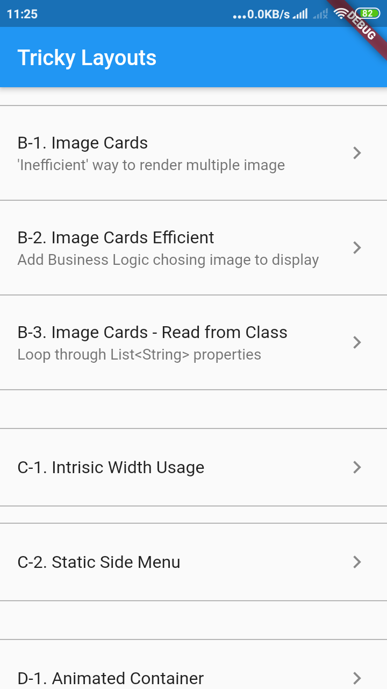

## Rendering Images

Images can be displayed using several methods :

In this docs, we are going to cover :

1. Hardcoded, Static, Inefficient Way to render multiple image. [Source](https://github.com/ejabu/flutter_tricky_layout/blob/master/lib/b_screen/image_card_screen.dart)

2. Add business logic to choose which image to display [Source](https://github.com/ejabu/flutter_tricky_layout/blob/master/lib/b_screen/image_card_screen_efficient.dart)

3. Read multiple image file from Class [Source](https://github.com/ejabu/flutter_tricky_layout/blob/master/lib/b_screen/image_card_store.dart)

### Demo

**Link :**

https://github.com/ejabu/flutter_tricky_layout/tree/master/lib/b_screen